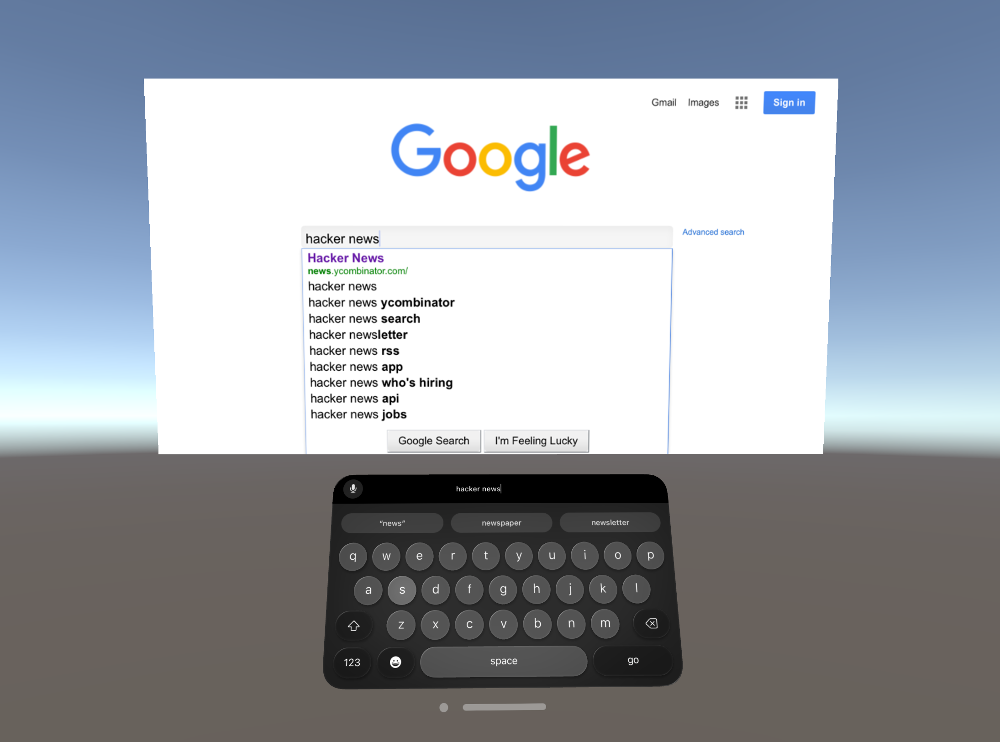

# visionOS VR WebView Example

This Unity project demonstrates how to view and interact with web content in VR on Apple Vision Pro using [Vuplex 3D WebView](https://developer.vuplex.com/webview/overview). All you need to do is import 3D WebView for visionOS into the project and then build one of the following example scenes for visionOS:

- Scenes/XritWebViewDemo.unity: Demonstrates interaction with a [CanvasWebViewPrefab](https://developer.vuplex.com/webview/CanvasWebViewPrefab) using [XR Interaction Toolkit](https://support.vuplex.com/articles/xr-interaction-toolkit).
- Scenes/InputSystemWebViewDemo.unity: Demonstrates interaction with a [CanvasWebViewPrefab](https://developer.vuplex.com/webview/CanvasWebViewPrefab) using the [Input System](https://docs.unity3d.com/Packages/com.unity.inputsystem@1.8/manual/index.html) package's [InputSystemUIInputModule](https://docs.unity3d.com/Packages/com.unity.inputsystem@1.7/api/UnityEngine.InputSystem.UI.InputSystemUIInputModule.html).




Please note that there is not currently an example of interacting with the non-Canvas [WebViewPrefab](https://developer.vuplex.com/webview/WebViewPrefab) on visionOS.

## Steps taken to create this project

1. Created a new project with Unity 2022.3.22 using the built-in 3D project template. 3D WebView for visionOS requires Unity 2022.3.19 or newer.
2. Opened the Unity Package Manager and did the following:
    - Imported v1.1.6 of the [Apple visionOS XR Plugin](https://docs.unity3d.com/Packages/com.unity.xr.visionos@1.0/manual/index.html) package (com.unity.xr.visionos). 3D WebView for visionOS requires this package to be v1.1 or newer.
    - On the page for the com.unity.xr.visionos package, clicked on the "Samples" tab and clicked "Import" button for "VR Sample - Built-in".
    - Imported the [XR Interaction Toolkit package](https://docs.unity3d.com/Packages/com.unity.xr.interaction.toolkit@2.5/manual/index.html) (com.unity.xr.interaction.toolkit).
3. Made the following copies of the VR sample scenes:

```sh
mkdir Assets/Scenes
cp "Assets/Samples/Apple visionOS XR Plugin/1.x.x/VR Sample - Built-in/Scenes/Main.unity" Assets/Scenes/XritWebViewDemo.unity
cp "Assets/Samples/Apple visionOS XR Plugin/1.x.x/VR Sample - Built-in/Scenes/InputSystem UI.unity" Assets/Scenes/InputSystemWebViewDemo.unity
```

4. Made the following modifications to the copied XritWebViewDemo.unity scene:
    - Copied and pasted the Canvas object from 3D WebView's CanvasWorldSpaceDemo scene in to the scene.
    - Deleted the scene's original "Sample Canvas" canvas and repositioned the Canvas from the CanvasWorldSpaceDemo scene to take its place.
    - Made the following changes to the Canvas object:
        - Set its Event Camera to the scene's main camera
        - Added a Tracked Device Graphic Raycaster component
        - Removed the CanvasKeyboard child object
    - Deleted the extra unneeded objects from the original Main.unity scene, such as AnchorPlacer, Input Tester, Collider Target, Grab Interactable Left, Grab Interactable Right, Sphere, and Cube

5. Made the following modifications to the copied InputSystemWebViewDemo.unity scene:
    - Copied and pasted the Canvas object from 3D WebView's CanvasWorldSpaceDemo scene in to the scene.
    - Deleted the scene's original "Sample Canvas" canvas and repositioned the Canvas from the CanvasWorldSpaceDemo scene to take its place.
    - Made the following changes to the Canvas object:
        - Set its Event Camera to the scene's main camera
        - Added a Tracked Device Raycaster component
        - Removed the CanvasKeyboard child object

6. Deleted the Assets/Samples directory containing the original sample scenes.

7. Updated the following project settings:
    - "XR Plug-in Management": enabled the "Apple visionOS" XR plugin
    - "XR Plug-in Management" -> "Apple visionOS": added values for "Hand Tracking Usage Description" and "World Sensing Usage Description"
    - Player Settings:
        - Disabled "Show Splash Screen"
        - Changed "Color Space" to "Linear"